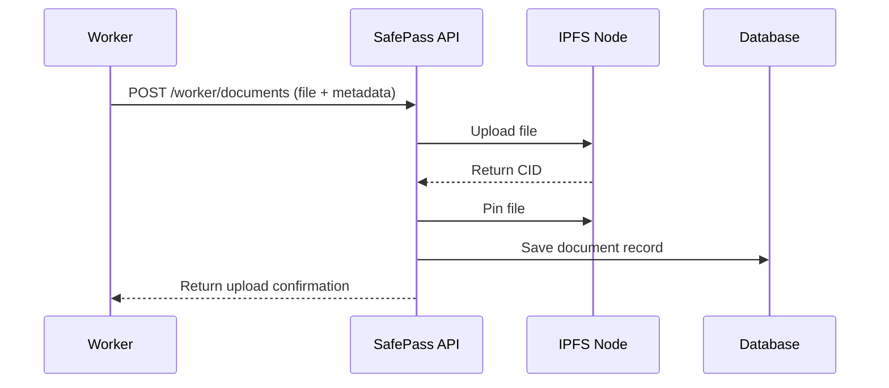
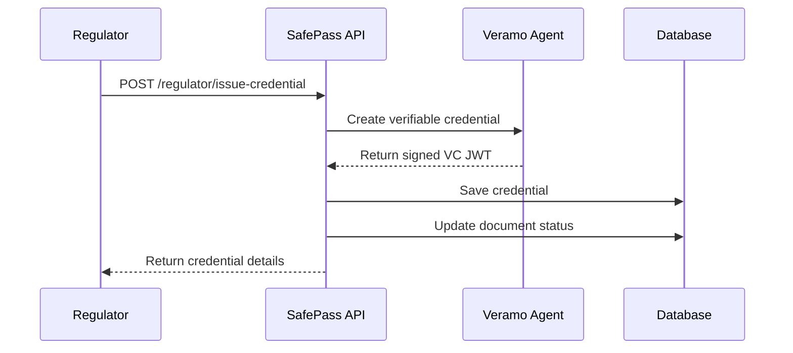

# Phase 4: Verifiable Credential Ecosystem

This document describes the implementation of Phase 4 of the SafePass project, which enables users (workers) to upload personal documents, have them verified by trusted authorities (regulators), and receive cryptographically signed, tamper-proof Verifiable Credentials in return.

## 🎯 Overview

Phase 4 implements a complete Verifiable Credential ecosystem with the following key features:

- **Document Upload**: Workers can upload personal documents (passport, NID, certificates) for verification
- **IPFS Storage**: Raw documents are stored off-chain on IPFS for decentralized, immutable storage
- **Verification Workflow**: Regulators can review uploaded documents and either approve or reject them
- **Credential Issuance**: Approved documents result in W3C-compliant Verifiable Credentials
- **Cryptographic Proof**: All credentials are cryptographically signed using DIDs and stored as JWTs
- **Public Verification**: Anyone can verify the authenticity of issued credentials

## 🏗️ Architecture

```
┌─────────────────┐    ┌─────────────────┐    ┌─────────────────┐
│     Worker      │    │   Regulator     │    │  Public/Verifier│
│                 │    │                 │    │                 │
│ 1. Upload Doc   │    │ 3. Review Doc   │    │ 6. Verify Cred  │
│ 2. Get Creds    │    │ 4. Issue VC     │    │                 │
└─────────────────┘    └─────────────────┘    └─────────────────┘
         │                       │                       │
         └───────────────────────┼───────────────────────┘
                                 │
                    ┌─────────────────┐
                    │   SafePass API  │
                    │                 │
                    │ • Authentication│
                    │ • File Upload   │
                    │ • VC Issuance   │
                    │ • Verification  │
                    └─────────────────┘
                                 │
         ┌───────────────────────┼───────────────────────┐
         │                       │                       │
┌─────────────────┐    ┌─────────────────┐    ┌─────────────────┐
│      IPFS       │    │   Supabase DB   │    │  Veramo Agent   │
│                 │    │                 │    │                 │
│ • File Storage  │    │ • User Data     │    │ • DID Management│
│ • Content IDs   │    │ • Doc Metadata  │    │ • VC Creation   │
│ • Pinning       │    │ • Credentials   │    │ • Crypto Signing│
└─────────────────┘    └─────────────────┘    └─────────────────┘
```

## 🔧 Technical Components

### 1. Database Schema

#### `document_uploads` Table
Tracks the status of every document uploaded by workers:

```sql
CREATE TABLE document_uploads (
    id UUID PRIMARY KEY,
    user_id UUID REFERENCES users(id),
    document_type VARCHAR(100) NOT NULL,
    ipfs_cid VARCHAR(255) NOT NULL,
    status VARCHAR(50) DEFAULT 'PendingVerification',
    created_at TIMESTAMP DEFAULT NOW(),
    reviewed_at TIMESTAMP,
    reviewer_notes TEXT,
    reviewer_id UUID REFERENCES users(id)
);
```

#### `verifiable_credentials` Table
Stores issued Verifiable Credentials:

```sql
CREATE TABLE verifiable_credentials (
    id UUID PRIMARY KEY,
    holder_did VARCHAR(255) NOT NULL,
    issuer_did VARCHAR(255) NOT NULL,
    type VARCHAR(100) NOT NULL,
    issuance_date TIMESTAMP DEFAULT NOW(),
    raw_vc_jwt TEXT NOT NULL,
    source_document_id UUID REFERENCES document_uploads(id)
);
```

### 2. IPFS Service (`src/services/ipfsService.ts`)

Handles all IPFS interactions:

```typescript
class IPFSService {
    async uploadFile(fileBuffer: Buffer, filename?: string): Promise<string>
    async getFile(cid: string): AsyncGenerator<Uint8Array>
    async getFileAsBuffer(cid: string): Promise<Buffer>
    async pinFile(cid: string): Promise<void>
    async isOnline(): Promise<boolean>
}
```

### 3. Enhanced Veramo Agent

Updated to include W3C Verifiable Credentials plugin:

```typescript
import { CredentialPlugin } from '@veramo/credential-w3c';

const agent = createAgent<IDIDManager & IKeyManager & ICredentialIssuer>({
    plugins: [
        new KeyManager(/* ... */),
        new DIDManager(/* ... */),
        new CredentialPlugin(), // Added for VC support
        // ... other plugins
    ],
});
```

### 4. API Endpoints

#### Worker Endpoints

- `POST /api/worker/documents` - Upload a document for verification
- `GET /api/worker/documents` - Get uploaded documents and their status
- `GET /api/worker/me/credentials` - Get issued verifiable credentials

#### Regulator Endpoints

- `GET /api/regulator/documents/pending` - Get pending documents for review
- `POST /api/regulator/issue-credential` - Issue a verifiable credential
- `POST /api/regulator/reject-document` - Reject a document upload

#### Public Endpoints

- `GET /api/credentials/verify/:jwt` - Verify a verifiable credential

## 🚀 Getting Started

### Prerequisites

1. **Node.js** (v16 or higher)
2. **Docker** (for IPFS node)
3. **Supabase** account and project
4. **Environment variables** configured

### Installation

1. **Install dependencies**:
   ```bash
   npm install
   ```

2. **Start IPFS node**:
   ```bash
   npm run start:ipfs
   ```

3. **Update database schema**:
   ```bash
   npm run setup:db
   ```

4. **Start the API server**:
   ```bash
   npm run api:dev
   ```

### Testing

Run the comprehensive Phase 4 test:

```bash
node test-phase4.js
```

This test demonstrates the complete workflow:
1. User registration and authentication
2. Document upload to IPFS
3. Regulator review process
4. Verifiable credential issuance
5. Credential retrieval and verification

## 📋 Workflow

### 1. Document Upload Workflow



### 2. Credential Issuance Workflow



## 🔐 Security Features

### 1. Cryptographic Signatures
- All credentials are cryptographically signed using the regulator's DID
- Uses Ethereum-based DIDs with secp256k1 keys
- Tamper-proof JWT format

### 2. Role-Based Access Control
- **Workers**: Can only upload documents and view their own credentials
- **Regulators**: Can review documents and issue credentials
- **Public**: Can verify credentials but not access private data

### 3. Data Privacy
- Raw documents stored on IPFS (off-chain)
- Only metadata and proofs stored on-chain
- Row-level security policies in database

### 4. Immutable Storage
- IPFS provides content-addressed, immutable storage
- Files are pinned to prevent garbage collection
- Content integrity verified by CID

## 📊 Supported Document Types

- **Passport** → `VerifiedPassportCredential`
- **National ID (NID)** → `VerifiedNationalIDCredential`
- **Training Certificate** → `VerifiedTrainingCredential`
- **Education Certificate** → `VerifiedEducationCredential`
- **Skills Certificate** → `VerifiedSkillsCredential`
- **Work Permit** → `VerifiedWorkPermitCredential`

## 🔍 Verifiable Credential Structure

```json
{
  "@context": [
    "https://www.w3.org/2018/credentials/v1",
    "https://safepass.example.com/contexts/v1"
  ],
  "type": ["VerifiableCredential", "VerifiedPassportCredential"],
  "issuer": {
    "id": "did:ethr:besu:0x..."
  },
  "credentialSubject": {
    "id": "did:ethr:besu:0x...",
    "documentType": "Passport",
    "ipfsCid": "QmXXX...",
    "verificationDate": "2024-01-01T00:00:00Z",
    "passportNumber": "A1234567",
    "nationality": "Bangladeshi",
    "expiryDate": "2030-12-31"
  },
  "issuanceDate": "2024-01-01T00:00:00Z",
  "proof": {
    "type": "JwtProof2020",
    "jwt": "eyJ0eXAiOiJKV1QiLCJhbGciOiJFUzI1NkstUiJ9..."
  }
}
```

## 🛠️ Configuration

### Environment Variables

```bash
# IPFS Configuration
IPFS_API_URL=http://localhost:5001

# Veramo Configuration
VERAMO_DB_PATH=./veramo-data.sqlite
MASTER_KEY=your-master-key-here

# Besu Network
BESU_RPC_URL=http://localhost:8545
```

### File Upload Limits

- **Maximum file size**: 10MB
- **Allowed formats**: JPEG, PNG, GIF, PDF
- **Storage**: In-memory processing, IPFS persistence

## 🔄 Status Flow

```
PendingVerification → Approved → Credential Issued
                   ↘ Rejected
```

1. **PendingVerification**: Document uploaded, awaiting regulator review
2. **Approved**: Document verified, credential issued
3. **Rejected**: Document rejected with reviewer notes

## 🧪 Testing

### Unit Tests
```bash
npm test
```

### Integration Tests
```bash
node test-phase4.js
```

### Manual Testing
Use tools like Postman or curl to test individual endpoints:

```bash
# Upload document
curl -X POST http://localhost:3001/api/worker/documents \
  -H "Authorization: Bearer YOUR_TOKEN" \
  -F "file=@document.pdf" \
  -F "documentType=Passport"

# Issue credential
curl -X POST http://localhost:3001/api/regulator/issue-credential \
  -H "Authorization: Bearer REGULATOR_TOKEN" \
  -H "Content-Type: application/json" \
  -d '{
    "documentUploadId": "uuid",
    "holderDid": "did:ethr:besu:0x...",
    "claims": {
      "passportNumber": "A1234567",
      "nationality": "Bangladeshi"
    }
  }'
```

## 🚨 Error Handling

### Common Errors

1. **IPFS Connection Failed**
   - Ensure IPFS node is running
   - Check IPFS_API_URL configuration

2. **Invalid File Type**
   - Only images and PDFs are allowed
   - Check file MIME type

3. **Unauthorized Access**
   - Verify JWT token is valid
   - Check user role permissions

4. **Document Not Found**
   - Verify document ID exists
   - Check document status

## 🔮 Future Enhancements

1. **Batch Processing**: Support for multiple document uploads
2. **Advanced Verification**: OCR and AI-powered document validation
3. **Credential Templates**: Customizable credential schemas
4. **Revocation Registry**: Support for credential revocation
5. **Mobile SDK**: Native mobile app integration
6. **Selective Disclosure**: Zero-knowledge proof capabilities

## 📚 References

- [W3C Verifiable Credentials Data Model](https://www.w3.org/TR/vc-data-model/)
- [Veramo Framework Documentation](https://veramo.io/)
- [IPFS Documentation](https://docs.ipfs.io/)
- [DID Specification](https://www.w3.org/TR/did-core/)

## 🤝 Contributing

1. Fork the repository
2. Create a feature branch
3. Implement your changes
4. Add tests
5. Submit a pull request

## 📄 License

This project is licensed under the MIT License - see the LICENSE file for details.
